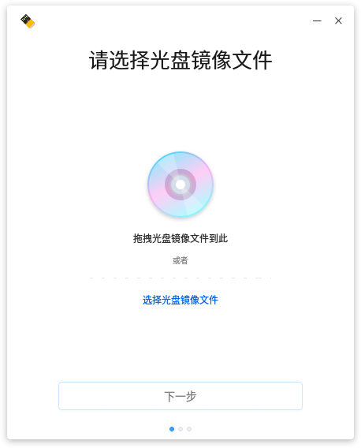
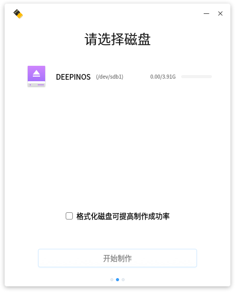
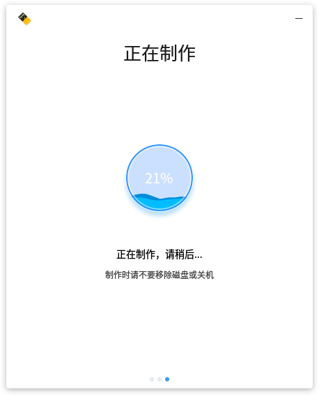
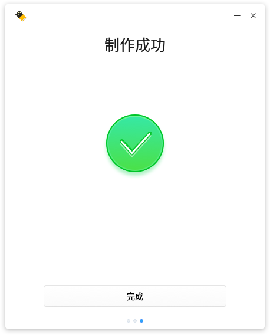
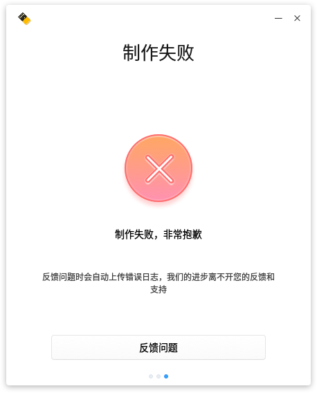
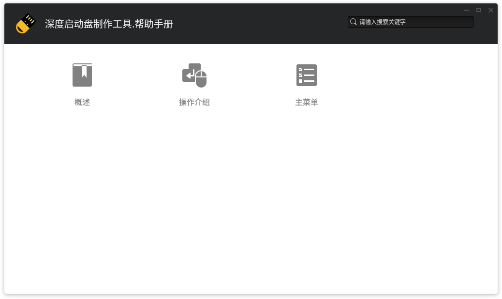
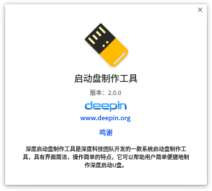

# 深度启动盘制作工具|../common/deepin-boot-maker.png|

## 概述|../common/icon_overview.svg|

深度启动盘制作工具是深度科技团队开发的一款系统启动盘制作工具，具有界面简洁、操作简单的特点，它可以帮助用户简单便捷地制作深度启动U盘。

## 操作介绍|../common/icon_commoncoperat.svg|

### 准备工作

1. 到深度官网下载最新的深度系统镜像文件。
2. 准备一个8GB的空白U盘。
3. 运行深度启动盘制作工具。
 - 深度操作系统已经默认集成了启动盘制作工具，可以直接在启动器中点击使用。
 - windows系统可以从光盘镜像中解压deepin-boot-maker.exe到电脑中使用。
 - 您也可以访问深度官网下载指定版本的启动盘制作工具来使用。

### 选择镜像文件
您可以通过以下两种方式选择镜像文件：

- 点击 **选择光盘镜像文件**，选中已下载的镜像文件后点击 **下一步**。
- 直接将镜像文件拖拽到制作工具界面，然后点击 **下一步**。

:请提前校验镜像文件的MD5值，确认和官网的MD5值一致后使用。非官方下载的镜像文件或者文件下载不完成可能会导致制作失败。

### 选择制作U盘

选中制作启动盘使用的U盘，然后点击 **开始制作**。

:建议勾选 **格式化磁盘可以提高制作成功率**。

### 制作完成

制作过程需要一定的时间，请耐心等待，制作时请不要移除磁盘或关机。待进度条满格，出现 **制作成功** 的提示，表明启动盘已经制作完成。

## 主菜单|../common/icon_optionsetting.svg|

### 帮助

您可以点击帮助获取深度启动盘制作工具的帮助手册，通过帮助进一步让您了解和使用深度启动盘制作工具。

1. 在深度启动盘制作工具界面，点击 。
2. 点击 **帮助**。
3. 查看关于深度启动盘制作工具的帮助手册。

### 关于

您可以点击关于查看深度启动盘制作工具的版本介绍。

1. 在深度启动盘制作工具界面，点击 。
2. 点击 **关于**。
3. 查看关于深度启动盘制作工具的版本和介绍。

### 退出

您可以进入菜单栏点击退出深度启动盘制作工具。

1. 在深度启动盘制作工具界面，点击 。
2. 点击 **退出**。

