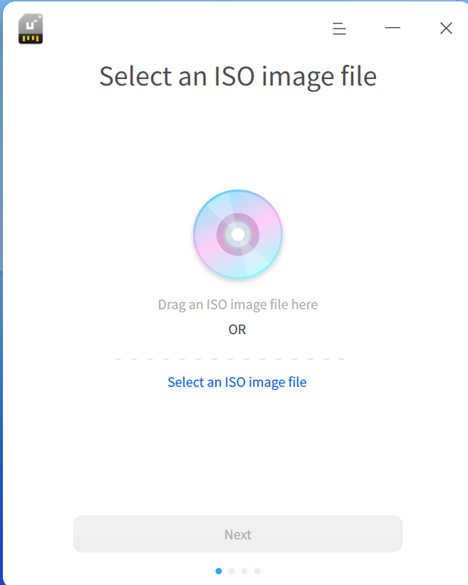
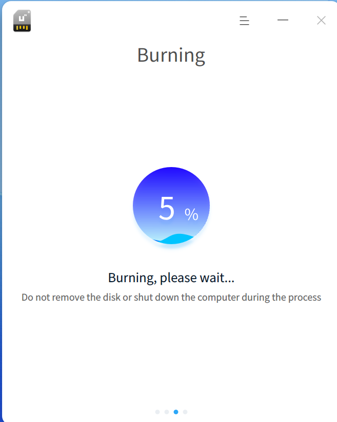

# Boot Disk Creation Tool | deepin-boot-maker

## Overview

The Boot Disk Creation Tool is a lightweight utility that writes system image files to installation media such as USB drives. It features a simple interface and straightforward operation.

## Getting Started

Run or close the Boot Disk Creation Tool, or create its shortcut using the methods below.

### Running the Boot Disk Creation Tool

1. Click the Launcher icon  on the taskbar to enter the Launcher interface.
2. Scroll the mouse wheel or search to locate the Boot Disk Creation Tool icon , then click to run.
3. Right-click  to:
   - Click **Send to Desktop** to create a desktop shortcut.
   - Click **Pin to Taskbar** to pin the app to the taskbar.
   - Click **Start on Boot** to add the app to startup items.

### Closing the Boot Disk Creation Tool

- Click  in the interface to exit.
- Right-click  on the taskbar and select **Close All**.
- Click  in the interface and select **Exit**.

## Operations Guide

### Preparations

1. Download the latest system image file from the official website.
2. Prepare a USB drive with at least 8GB capacity.
3. Obtain the Boot Disk Creation Tool:
   - Pre-installed on the system (find it in Launcher).
   - Download from the official website.
   - On Windows: Extract `xxx_boot_maker.exe` from the ISO file.

### Selecting the Image File

Choose an image file via:
- Click **Select Image File** → Choose downloaded file → Click **Next**.
- Drag the image file directly into the interface → Click **Next**.

### Selecting the Partition

Select the target USB drive. If the drive has multiple partitions, only the first is available. Click **Start Creation** or **Back**.
- **Start Creation**: Check **Format Partition** (back up USB data first!).
- **Back**: Return to the image selection screen.

### Successful Creation

The process may take time. Do not remove the USB or shut down the PC. When the progress bar is full and **Success** appears, the boot disk is ready.

&nbsp;&nbsp;&nbsp;&nbsp;&nbsp;&nbsp;&nbsp;&nbsp;&nbsp;&nbsp;&nbsp;&nbsp;&nbsp;

### Creation Failure

Failure may occur due to:
- Incorrect disk format
- Insufficient disk space
- Disk mount error
- Image decompression error

If an unknown error occurs, click **Submit Feedback** to report the issue on the forum.

## Main Menu

Access theme switching, help manual, and more via the main menu.

### Theme
Window themes include Light, Dark, and System.
1. Click  in the interface.
2. Select **Theme** → Choose a theme.

### Help
1. Click .
2. Select **Help** to view the manual.

### About
1. Click .
2. Select **About** to view version and introduction.

### Exit
1. Click .
2. Select **Exit**.