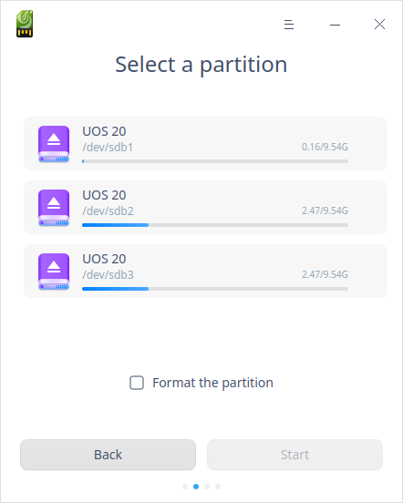
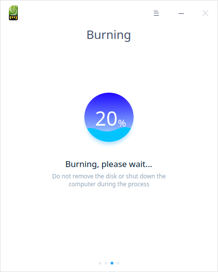
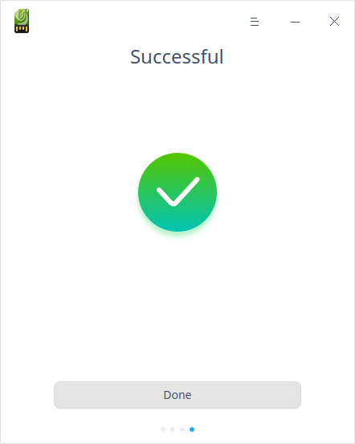
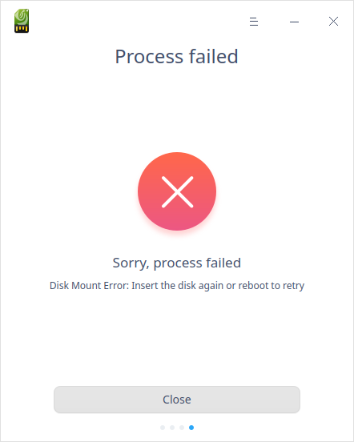

# Boot Maker|../common/deepin_boot_maker_96.svg|

## Overview

Boot Maker is an easy-to-use tool with a simple interface to help you burn the system image files into installation medium such as USB disks.

## Guide

You can run, close or create a shortcut for Boot Maker as follows.

### Run Boot Maker

1. Click  on the Dock to enter the interface of launcher.

2. Locate  by scrolling the mouse wheel or searching "Boot Maker" in the Launcher interface and click it to run. 

3. Right-click to:

   - Select **Send to desktop** to create a shortcut on the desktop.
   - Select  **Send to dock** to fix it onto the dock.
   - Select **Add to startup** to run it automatically when the computer is turned on.

###  Exit Boot Maker

- On the main interface, click to exit.
- Right-click   on the Dock, select **Close all** to exit.
- On interface of Device Manager, click   and select **Exit** to exit.

## Operations

### Preparation

1. Download the latest official image file from UnionTech OS official website.
2. Prepare a USB disk (8GB at least).
3. Run Boot Maker.
 - Boot Maker is built in UnionTech OS system by default, so you can find it in Launcher quickly.
 - For Windows system, you can also extract xxx-boot-maker.exe from the image file.
 - You can download its specified version from UnionTech OS official website.

### Select Image File

There are two ways to select the image file:

1. Click **Select an ISO image file** to select the downloaded file, then click **Next**.

2. Drag an ISO image file and drop it to the interface, then click **Next**.

### Select a Partition

Select the USB disk or partition, and click **Start** or **Back**.

   - Start: it is recommended to check **Format the partition**. Make sure you have saved the data inside the USB disk before burning.
   - Back: click this button to return to the previous step.

### Burned Successfully

It takes a few minutes to make a boot disk. Please wait patiently. Please do not remove the USB disk or shut down the computer. When the progress bar is full, a prompt **Successful** pops up, which means the boot disk is made successfully.  

### Burning Failed

Common causes of failure may include:

- Wrong disk format

- Wrong disk space 

- Wrong disk mounting

- Image distraction error

When some unknown error occurs, you will see the button **Feedback** in the "Process Failed" window. Click it  to jump to the relevant forum to submit your feedback. 

## Main Menu

In the main menu, you can switch themes, view manual, and so on.

### Theme

The window theme includes Light Theme, Dark Theme and System Theme.

1. Click on the interface.
2. Click  **Theme** to select one.

### Help

You can click to view the manual, which will help you further know and use Boot Maker.

1. Click on the interface.
2. Click **Help** to view the manual.

### About

1. Click on the interface.
2. Click **About** to view the version description and introduction.

### Exit

1. Click on the interface.
2. Click **Exit**.
