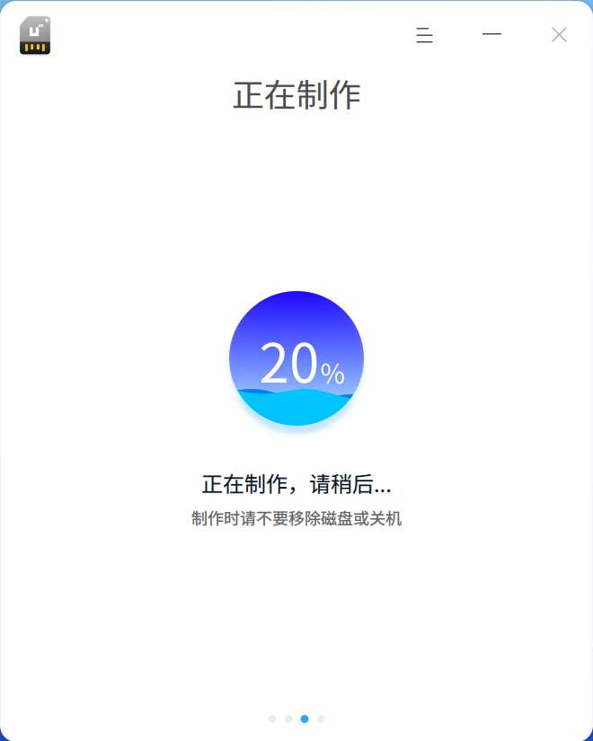
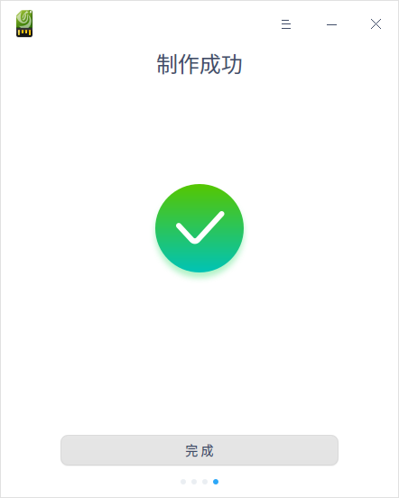

# 启动盘制作工具|deepin-boot-maker|

## 概述

启动盘制作工具是一款将系统镜像文件写入U盘等安装介质的小工具，界面简洁、操作简单。

## 使用入门

通过以下方式运行或关闭启动盘制作工具，或者创建启动盘制作工具的快捷方式。

### 运行启动盘制作工具

1. 单击任务栏上的启动器图标 ，进入启动器界面。
2. 上下滚动鼠标滚轮浏览或通过搜索，找到启动盘制作工具图标 ，单击运行。
3. 右键单击   ，您可以：
 - 单击 **发送到桌面**，在桌面创建快捷方式。
 - 单击 **发送到任务栏**，将应用程序固定到任务栏。
 - 单击 **开机自动启动**，将应用程序添加到开机启动项，在电脑开机时自动运行该应用。

### 关闭启动盘制作工具

   - 在启动盘制作工具界面单击  ，退出启动盘制作工具。
   - 在任务栏右键单击  ，选择 **关闭所有** 来退出启动盘制作工具。
   - 在启动盘制作工具界面单击  ，选择 **退出** 来退出启动盘制作工具。

## 操作介绍

### 准备工作

1. 到官网下载最新的系统镜像文件。
2. 准备一个至少8GB的U盘。
3. 获取启动盘制作工具。
   - 系统预装了启动盘制作工具，在启动器中查找。
   - 访问官网下载指定版本的启动盘制作工具。
   - Windows系统可以从光盘镜像中解压 xxx_boot_maker.exe 到电脑中。

### 选择镜像文件

您可以通过以下两种方式选择镜像文件：

- 单击 **请选择镜像文件**，选中已下载的镜像文件后单击 **下一步**。
- 直接将镜像文件拖拽到制作工具界面，然后单击 **下一步**。

### 选择分区

选中制作启动盘的U盘或分区，您可以单击 **开始制作** 或 **返回**  按钮。

- 开始制作：建议勾选 **格式化分区**，制作前请保存好U盘的数据。
- 返回：返回到选择镜像界面。

### 制作成功

制作过程需要一定的时间，请耐心等待，制作时请不要移除U盘或关机。待进度条满格，出现 **制作成功** 的提示，表明启动盘已经制作完成。

&nbsp;&nbsp;&nbsp;&nbsp;&nbsp;&nbsp;&nbsp;&nbsp;&nbsp;&nbsp;&nbsp;&nbsp;&nbsp;

### 制作失败

如果制作失败，可能由如下情况导致：

- 磁盘格式错误

- 磁盘空间不足

- 磁盘挂载错误

- 解压镜像错误

当出现未知错误时，制作失败窗口会出现 “提交反馈” 按钮。单击 **提交反馈** 后，跳转到相关论坛进行问题反馈。

## 主菜单

在主菜单中，您可以切换窗口主题、查看帮助手册等。

### 主题

窗口主题包含浅色主题、深色主题和系统主题。

1. 在启动盘制作工具界面，单击。
2. 单击 **主题**，选择一个主题颜色。

### 帮助

1. 在启动盘制作工具界面，单击 。
2. 单击 **帮助**，查看帮助手册，进一步了解和使用启动盘制作工具。

### 关于

1. 在启动盘制作工具界面，单击 。
2. 单击 **关于**，查看启动盘制作工具的版本和介绍。

### 退出

1. 在启动盘制作工具界面，单击 。
2. 单击 **退出**。

