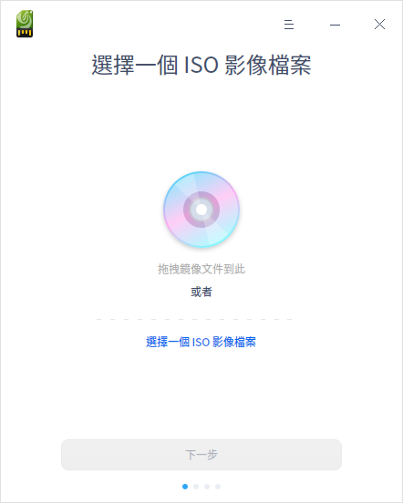
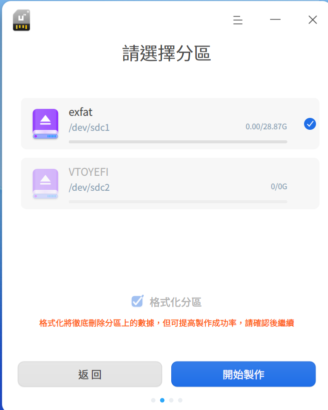
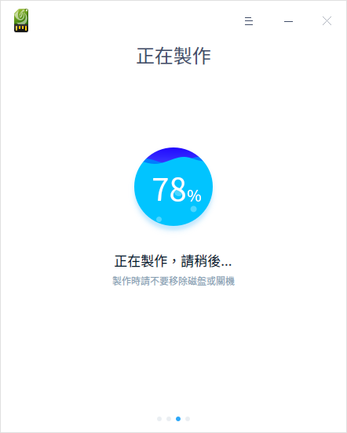
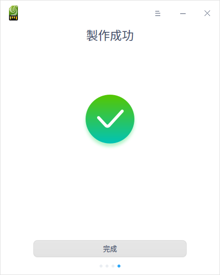
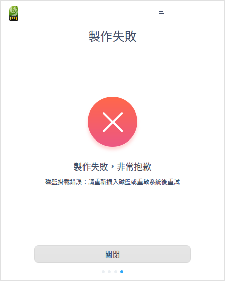

# 啟動盤製作工具|../common/deepin_boot_maker_96.svg|

## 概述

啟動盤製作工具是一款將系統鏡像文件寫入USB記憶體等安裝介質的小工具，界面簡潔、操作簡單。

## 使用入門

通過以下方式運行或關閉啟動盤製作工具，或者創建啟動盤製作工具的快捷方式。

### 運行啟動盤製作工具

1. 單擊任務欄上的啟動器圖標 ，進入啟動器界面。
2. 上下滾動鼠標滾輪瀏覽或通過搜索，找到啟動盤製作工具圖標 ，單擊運行。
3. 右鍵單擊   ，您可以：
 - 單擊 **發送到桌面**，在桌面創建快捷方式。
 - 單擊 **發送到任務欄**，將應用程序固定到任務欄。
 - 單擊 **開機自動啟動**，將應用程序添加到開機啟動項，在電腦開機時自動運行該應用。

### 關閉啟動盤製作工具

   - 在啟動盤製作工具界面單擊  ，退出啟動盤製作工具。
   - 在任務欄右鍵單擊  ，選擇 **關閉所有** 來退出啟動盤製作工具。
   - 在啟動盤製作工具界面單擊  ，選擇 **退出** 來退出啟動盤製作工具。

## 操作介绍

### 準備工作

1. 到官網下載最新的系統鏡像文件。
2. 準備一個至少8GB的USB記憶體。
3. 獲取啟動盤製作工具。
   - 統信UOS中預裝了啟動盤製作工具，可以直接在啟動器中找到並使用。
   - Windows系統可以從光盤鏡像中解壓 xxx_boot_maker.exe 到電腦中使用。
   - 您也可以訪問官網下載指定版本的啟動盤製作工具來使用。

### 選擇一個iso影像檔案

您可以通過以下兩種方式選擇鏡像文件：

- 單擊 **選擇一個iso影像檔案**，選中已下載的鏡像文件後單擊 **下一步**。
- 直接將鏡像文件拖拽到製作工具界面，然後單擊 **下一步**。

### 選擇分區

選中製作啟動盤的USB記憶體或分區，您可以單擊 **開始** 或 **返回**  按鈕。

- 開始製作：開始製作啟動盤，建議勾選 **格式化分區**，製作前請保存好USB記憶體的數據。
- 返回：返回到選擇鏡像界面。

### 製作成功

製作過程需要一定的時間，請耐心等待，製作時請不要移除USB記憶體或關機。待進度條滿格，出現「製作成功」的提示，表明啟動盤已經製作完成。

&nbsp;&nbsp;&nbsp;&nbsp;&nbsp;&nbsp;&nbsp;&nbsp;&nbsp;&nbsp;&nbsp;&nbsp;&nbsp;

### 製作失敗

如果製作失敗，可能由如下情況導致：

- 磁盤格式錯誤

- 磁盤空間不足

- 磁盤掛載錯誤

- 解壓鏡像錯誤

當出現未知錯誤時，製作失敗窗口會出現「售後服務」按鈕，單擊 **售後服務**，跳轉到「服務與支持」的主界面。在服務與支持應用中，您可以通過留言諮詢、在線諮詢等方式獲得幫助。

## 主菜單

在主菜單中，您可以切換窗口主題、查看幫助手冊等。

### 主題

窗口主題包含淺色主題、深色主題和系統主題。

1. 在啟動盤製作工具界面，單擊。
2. 單擊 **主題**，選擇一個主題顏色。

### 幫助

1. 在啟動盤製作工具界面，單擊 。
2. 單擊 **幫助**，查看幫助手冊，進一步了解和使用啟動盤製作工具。

### 關於

1. 在啟動盤製作工具界面，單擊 。
2. 單擊 **關於**，查看啟動盤製作工具的版本和介紹。

### 退出

1. 在啟動盤製作工具界面，單擊 。
2. 單擊 **退出**。