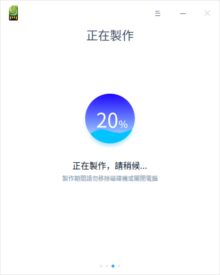
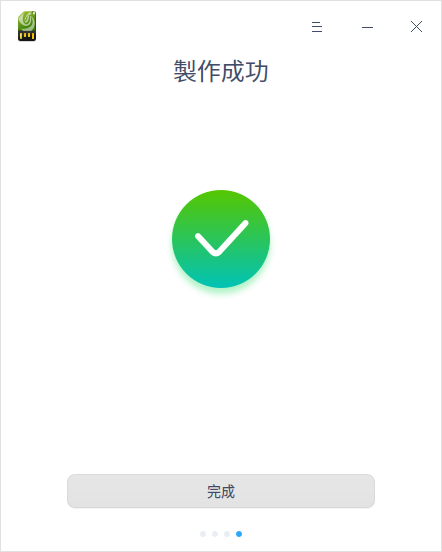
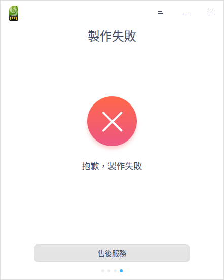

# 開機碟製作器|deepin-boot-maker|

## 概述

開機碟製作器是一款將系統鏡像文件寫入隨身碟等安裝介質的小工具，介面簡潔、操作簡單。

## 使用入門

透過以下方式執行或關閉開機碟製作器，或者建立開機碟製作器的捷徑。

### 執行開機碟製作器

1. 單擊任務欄上的啟動器 ，進入啟動器介面。
2. 上下滾動滑鼠滾輪瀏覽或透過搜尋，找到「開機碟製作器」按鈕 ，單擊開啟。
3. 右鍵單擊 ，您可以：

   - 單擊 **建立桌面捷徑**，在桌面建立捷徑。
   - 單擊 **釘選到Dock**，將應用程式固定到Dock。
   - 單擊 **開機啟動**，將應用程式添加到開機啟動項，在電腦開機時自動執行該應用。

### 關閉開機碟製作器

- 在開機碟製作器視窗，單擊 ，關閉開機碟製作器。
- 在任務欄右鍵單擊 ，選擇 **關閉所有** 來關閉開機碟製作器。
- 在開機碟製作器介面，單擊 ，選擇 **離開** 來關閉開機碟製作器。

## 操作介紹

### 執行準備工作

1. 到官網下載最新的系統鏡像文件。
2. 準備一個至少8GB的隨身碟。
3. 獲取啟動盤製作工具。
   - 系統預裝了啟動盤製作工具，在啟動器中查找。
   - 訪問官網下載指定版本的啟動盤製作工具。
   - Windows系統可以從光碟鏡像中解壓 xxx_boot_maker.exe 到電腦中。

### 選擇ISO檔案

您可以透過以下兩種方式選擇鏡像文件：

- 單擊 **選擇一個ISO檔案**，選中已下載的鏡像文件後單擊 **下一步**。
- 直接將鏡像文件拖曳到製作工具介面，然後單擊 **下一步**。

### 選擇分區

選中製作啟動盤的隨身碟，如果隨身碟有多個分區，只能選擇第一個分區。單擊**開始**或**返回**按鈕。

   - 開始製作：建議勾選 **格式化分區**，製作前請儲存好隨身碟的資料。
   - 返回：返回到選擇鏡像介面。

### 製作成功

製作過程需要一定的時間，請耐心等待，製作時請不要移除磁碟或關機。待進度條滿格，出現 **製作成功** 的提示，表明開機碟已經製作完成。

### 製作失敗

如果製作失敗，可能由如下情況導致：

- 磁碟格式錯誤
- 磁碟空間錯誤
- 磁碟掛載錯誤
- 解壓鏡像錯誤

當出現未知錯誤時，製作失敗視窗會出現「售後服務」按鈕，單擊 **售後服務**，跳轉到「服務與支持」的主介面。在服務與支持應用中，您可以透過留言諮詢、線上諮詢等方式獲得幫助。

## 主選單

在主選單中，您可以切換視窗主題、查看說明手冊，了解開機碟製作器的更多訊息。

### 主題

視窗主題包含亮色主題、暗色主題和系統主題。

1. 在開機碟製作器介面，單擊 。
2. 單擊 **主題**，選擇一個主題顏色。

### 說明

查看說明手冊，透過幫助進一步讓您了解和使用開機碟製作器。

1. 在開機碟製作器介面，單擊 。
2. 單擊 **說明**。
3. 查看關於開機碟製作器的說明手冊。

### 關於

1. 在開機碟製作器介面，單擊 。
2. 單擊 **關於**。
3. 查看關於開機碟製作器的版本和介紹。

### 離開

1. 在開機碟製作器介面，單擊 。
2. 單擊 **離開**。